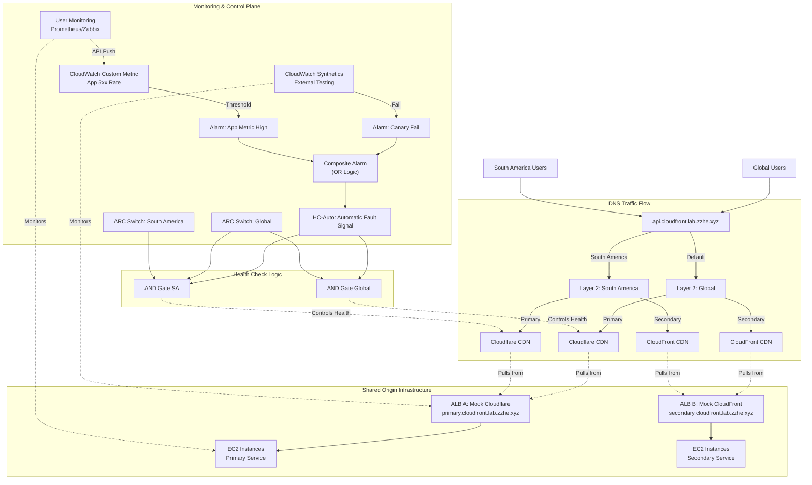

AWS Multi-CDN Control Lab

A Proof of Concept (PoC) demonstrating a Hybrid Traffic Control Architecture. This lab solves the latency issues inherent in DNS-based failover by combining Server-Side traffic steering (Route 53) with Client-Side dynamic routing (HTTPDNS/Bootstrap Config).

🎯 The Problem

Traditional DNS Failover (e.g., Route 53 Health Checks) suffers from "Propagation Lag." When a primary CDN (e.g., Cloudflare) fails, it can take anywhere from several minutes to over an hour for users to naturally switch to the backup (e.g., CloudFront) due to TTL caching and ISP behavior.

💡 The Solution

This lab implements a dual-layer approach:

Server-Side (The Safety Net): AWS Route 53 with Application Recovery Controller (ARC) for broad, region-based traffic shaping.

Client-Side (The Speed): A "Bootstrap Config" pattern where the App/Web client asks "Where should I go?" before making requests, allowing for instant switching.

🏗 Architecture

## AWS Route 53 + Multi-CDN (Cloudflare & CloudFront) Hybrid Cloud High Availability Architecture

### 1. Architecture Overview

This solution utilizes AWS Route 53 as the traffic control plane, integrating Cloudflare (Primary CDN) and CloudFront (Backup/Regional CDN).


**Core Logic:**
- **Layered Routing**: Global and South America strategies are decoupled (Layer 1 & Layer 2) for CDN selection, but **share the same origin infrastructure**
- **Shared Origin**: Both Cloudflare and CloudFront CDNs (Global & SA) pull content from the same backend origin servers
- **Multi-source Fault Signals:**
  - Signal Source A: AWS CloudWatch Synthetics (external synthetic testing)
  - Signal Source B: User-built monitoring (internal business metrics, such as 5xx rate)
  - Aggregation Logic: HC-Auto = Signal Source A OR Signal Source B
- **Fine-grained Control**: Retain independent manual failback capability for Global/South America regions

**Architecture Diagram:**



### 2. Shared Origin Architecture

**Key Concept**: This lab demonstrates that Global and South America regions **share the same origin infrastructure**. The geographic routing happens at the DNS/CDN edge level, not at the origin level.

**How it works:**
- **Single Origin**: One set of origin servers (ALB A + EC2 for primary, ALB B + EC2 for secondary)
- **CDN Layer**: Cloudflare and CloudFront both cache content from these shared origins
- **Geographic Routing**: Route 53 directs users to different CDN edges based on their location
- **Shared Health**: Origin health affects all regions simultaneously - if the origin fails, both Global and SA users are affected

**Benefits:**
- **Simplified Operations**: One origin infrastructure to maintain
- **Cost Effective**: No need to replicate origin servers across regions
- **Consistent Data**: All users see the same content regardless of their CDN path
- **Unified Monitoring**: Single set of origin metrics affects all routing decisions

### 3. Detailed Configuration Steps

**Phase 1: Configure Multi-source Monitoring Signals (New)**

We need to integrate user monitoring data into AWS and merge it with AWS probe data.

**1. Integrate User-built Monitoring Data**

User systems (such as Prometheus, Zabbix, or log analysis systems) need to call AWS API to report key metrics.

Operation: Use AWS CLI or SDK (PutMetricData)

Example command:
```bash
aws cloudwatch put-metric-data \
  --namespace "Custom/AppMetrics" \
  --metric-name "ApiErrorRate" \
  --value 5.2 \
  --unit Percent \
  --dimensions Region=Global
```

**Create Alarm (Alarm B):**
- Create alarm in CloudWatch based on Custom/AppMetrics -> ApiErrorRate
- Threshold example: Trigger ALARM when error rate > 5% within 5 minutes

**2. Create Composite Alarm**

Merge "external synthetic testing alarm" and "internal business alarm" to avoid single-point false positives or missed alerts.

Prerequisites: Have Canary-based alarm (Alarm A) and user metric-based alarm (Alarm B)

Operation: Create Composite Alarm
- Logic expression: ALARM(Alarm_A) OR ALARM(Alarm_B)
- Effect: Composite alarm enters ALARM state when either external testing fails OR internal business metrics deteriorate

**Phase 2: Health Checks and ARC Switch**

Update basic signal definition, using composite alarm as automatic signal source.

**HC-Auto (Updated):**
- Type: CloudWatch Alarm
- Target: Select the Composite Alarm created in previous step
- Logic: When composite alarm triggers, this HC becomes Unhealthy

**HC-Switch-Global (ARC Switch):** Unchanged, for manual global control
**HC-Switch-SA (ARC Switch):** Unchanged, for manual South America control

**Calculated Health Checks (Logic Combination):**
- HC-Logic-Global (AND): HC-Auto + HC-Switch-Global
- HC-Logic-SA (AND): HC-Auto + HC-Switch-Global + HC-Switch-SA

**Phase 3: Configure Layered DNS Records (Maintain V2.0 Structure)**

Structure needs no changes, only ensure Layer 2 Primary Records reference updated Calculated Health Checks.

(Brief Review)
- Layer 1 (Entry): api.cloudfront.lab.zzhe.xyz uses Geolocation pointing to sa-rule or global-rule
- Layer 2 (Rules): sa-rule and global-rule use Failover strategy, Primary points to Cloudflare, Secondary points to CloudFront

### 4. Operations Scenario Testing

Scenario changes after adding user monitoring:

| Scenario | Trigger Condition | Result |
|----------|------------------|--------|
| External Network Outage | AWS Canary detects Cloudflare failure → Alarm A triggers → Composite Alarm triggers | Automatic switch to CloudFront |
| Internal Business Exception | User system detects API error rate spike → Push metrics → Alarm B triggers → Composite Alarm triggers | Automatic switch to CloudFront |
| False Positive Filtering (Optional) | If changed to AND logic, requires both parties to alarm simultaneously for switching (usually not recommended, OR logic recommended for high availability) | (Depends on composite alarm logic) |
| Manual Force Switchover | Administrator manually turns off ARC switch | Force switch to CloudFront |

### 5. Additional Notes

- **Access Authentication**: Servers running user monitoring systems need IAM Role or AK/SK configured with `cloudwatch:PutMetricData` permissions
- **Cost Optimization**: Custom Metrics and Alarms incur minimal fees, negligible compared to business high availability value
- **Latency**: PutMetricData to Alarm trigger typically has 1-3 minute delay (depends on Standard Resolution vs High Resolution). For second-level response, recommend enabling CloudWatch High Resolution Metrics (1-second granularity)

Directory Structure

aws-multi-cdn-control-lab/
├── infrastructure/    # Pulumi IaC for Route 53, ARC, ALB, and Mock CDNs
├── control-plane/     # EC2 instances for the Config API behind ALB
├── client-app/        # React Web App demonstrating the "Smart Client"
└── simulation/        # Python scripts to break endpoints and flip switches


Traffic Flow

**Shared Origin Infrastructure:**
- **Mock Primary (Cloudflare)**: Simulated via ALB A with EC2 instances at `primary.cloudfront.lab.zzhe.xyz`
- **Mock Secondary (CloudFront)**: Simulated via ALB B with EC2 instances at `secondary.cloudfront.lab.zzhe.xyz`

**Important**: In this lab, both Global and South America regions use the **same origin servers**. The CDNs (Cloudflare and CloudFront) would normally cache content from these shared origins, with geographic routing at the DNS layer determining which CDN edge users connect to.

**Control Plane**: A highly available API running on EC2 instances behind ALB that reads the state of our "Emergency Switch" (Route 53 ARC).

Client:

Fetches configuration on startup.

Attempts Primary.

If Primary fails (Chaos induced), automatically retries Secondary without waiting for DNS updates.

🚀 Getting Started

Prerequisites

AWS CLI (configured with Administrator access for the lab)

Pulumi CLI

Go 1.19+ (for infrastructure code)

Node.js v16+ (for the client)

Python 3.9+ (for simulation scripts)

Domain: Access to zzhe.xyz domain for creating lab subdomains (*.cloudfront.lab.zzhe.xyz)

1. Deploy Infrastructure

Provision the ALB endpoints, EC2 instances, Route 53 zones, and Health Checks with cloudfront.lab.zzhe.xyz subdomains.

cd infrastructure
pulumi stack init
pulumi up


Note the outputs:
- config_api_url: https://api.cloudfront.lab.zzhe.xyz
- primary_alb_url: https://primary.cloudfront.lab.zzhe.xyz
- secondary_alb_url: https://secondary.cloudfront.lab.zzhe.xyz

2. Configure Client

Update the client configuration with the ALB URLs from the Pulumi output.

cd ../client-app
# Edit .env or src/config.ts with the infrastructure URLs
npm install
npm run dev


3. Run Simulation (Chaos Mode)

Open the web app. You should see a Green status (Connected to Primary).

Scenario A: Simulate Technical Failure
Run the script to make the "Mock Primary" return 503 errors.

python3 simulation/break_primary.py


Observe the Client App automatically switch to Secondary (Yellow/Orange status).

Scenario B: Manual Kill Switch
Force traffic over via AWS Route 53 ARC.

python3 simulation/toggle_arc.py --state OFF


💰 Cost Warning

This lab creates real AWS resources.

Route 53 ARC: Can be expensive ($195/mo/cluster) if using the Cluster features. For this lab, we use standard Route 53 Health Checks + Inverted Logic to simulate ARC behavior at a lower cost.

ALB + EC2: Costs for Application Load Balancers and EC2 instances running the mock services.

CloudWatch: Small costs for alarms and metrics.

Cleanup: Always run pulumi destroy when finished!

📜 License

MIT