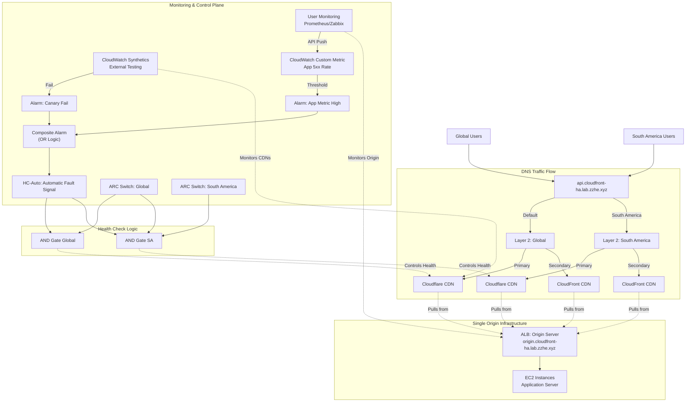

AWS Multi-CDN Control Lab

A Proof of Concept (PoC) demonstrating a Hybrid Traffic Control Architecture. This lab solves the latency issues inherent in DNS-based failover by combining Server-Side traffic steering (Route 53) with Client-Side dynamic routing (HTTPDNS/Bootstrap Config).

🎯 The Problem

Traditional DNS Failover (e.g., Route 53 Health Checks) suffers from "Propagation Lag." When a primary CDN (e.g., Cloudflare) fails, it can take anywhere from several minutes to over an hour for users to naturally switch to the backup (e.g., CloudFront) due to TTL caching and ISP behavior.

💡 The Solution

This lab implements a dual-layer approach:

Server-Side (The Safety Net): AWS Route 53 with Application Recovery Controller (ARC) for broad, region-based traffic shaping.

Client-Side (The Speed): A "Bootstrap Config" pattern where the App/Web client asks "Where should I go?" before making requests, allowing for instant switching.

🏗 Architecture

## AWS Route 53 + Multi-CDN (Cloudflare & CloudFront) Hybrid Cloud High Availability Architecture

### 1. Architecture Overview

This solution utilizes AWS Route 53 as the traffic control plane, integrating Cloudflare (Primary CDN) and CloudFront (Backup/Regional CDN).


**Core Logic:**
- **Layered Routing**: Global and South America strategies are decoupled (Layer 1 & Layer 2) for CDN selection, but **share the same origin infrastructure**
- **Shared Origin**: Both Cloudflare and CloudFront CDNs (Global & SA) pull content from the same backend origin servers
- **Multi-source Fault Signals:**
  - Signal Source A: AWS CloudWatch Synthetics (external synthetic testing)
  - Signal Source B: User-built monitoring (internal business metrics, such as 5xx rate)
  - Aggregation Logic: HC-Auto = Signal Source A OR Signal Source B
- **Fine-grained Control**: Retain independent manual failback capability for Global/South America regions

**Architecture Diagram:**



### 2. Single Origin + Multi-CDN Architecture

**Key Concept**: This lab demonstrates **one origin server** with **two CDN vendors** for high availability. Route 53 handles failover between CDN vendors, not between origins.

**How it works:**
- **Single Origin**: One origin server (ALB + EC2) at `origin.cloudfront-ha.lab.zzhe.xyz`
- **Dual CDN Setup**:
  - **Cloudflare CDN** pulls content from the origin (Primary CDN)
  - **CloudFront CDN** pulls content from the same origin (Backup CDN)
- **Route 53 Failover**: Routes end users between Cloudflare and CloudFront based on CDN health
- **Geographic Routing**: Route 53 also provides geographic optimization (Global vs South America)

**Benefits:**
- **CDN Vendor Redundancy**: If one CDN provider has issues, automatic failover to the other
- **Single Origin Maintenance**: Only one application server to manage and update
- **Cost Effective**: No origin duplication, pay for CDN bandwidth only when needed
- **Vendor Independence**: Not locked into a single CDN provider

### 3. Detailed Configuration Steps

**Phase 1: Configure Multi-source Monitoring Signals (New)**

We need to integrate user monitoring data into AWS and merge it with AWS probe data.

**1. Integrate User-built Monitoring Data**

User systems (such as Prometheus, Zabbix, or log analysis systems) need to call AWS API to report key metrics.

Operation: Use AWS CLI or SDK (PutMetricData)

Example command:
```bash
aws cloudwatch put-metric-data \
  --namespace "Custom/AppMetrics" \
  --metric-name "ApiErrorRate" \
  --value 5.2 \
  --unit Percent \
  --dimensions Region=Global
```

**Create Alarm (Alarm B):**
- Create alarm in CloudWatch based on Custom/AppMetrics -> ApiErrorRate
- Threshold example: Trigger ALARM when error rate > 5% within 5 minutes

**2. Create Composite Alarm**

Merge "external synthetic testing alarm" and "internal business alarm" to avoid single-point false positives or missed alerts.

Prerequisites: Have Canary-based alarm (Alarm A) and user metric-based alarm (Alarm B)

Operation: Create Composite Alarm
- Logic expression: ALARM(Alarm_A) OR ALARM(Alarm_B)
- Effect: Composite alarm enters ALARM state when either external testing fails OR internal business metrics deteriorate

**Phase 2: Health Checks and ARC Switch**

Update basic signal definition, using composite alarm as automatic signal source.

**HC-Auto (Updated):**
- Type: CloudWatch Alarm
- Target: Select the Composite Alarm created in previous step
- Logic: When composite alarm triggers, this HC becomes Unhealthy

**HC-Switch-Global (ARC Switch):** Unchanged, for manual global control
**HC-Switch-SA (ARC Switch):** Unchanged, for manual South America control

**Calculated Health Checks (Logic Combination):**
- HC-Logic-Global (AND): HC-Auto + HC-Switch-Global
- HC-Logic-SA (AND): HC-Auto + HC-Switch-Global + HC-Switch-SA

**Phase 3: Configure Layered DNS Records - Manual Step-by-Step Guide**

This phase sets up the two-layer DNS routing structure that enables geographic-based CDN selection with automatic failover.

**Overview of DNS Layers:**
- **Layer 1 (Entry Point)**: Geographic routing that directs users to appropriate regional rules
- **Layer 2 (Regional Rules)**: Failover logic within each geographic region

### Step-by-Step DNS Configuration

#### Prerequisites
- Route 53 hosted zone for `cloudfront-ha.lab.zzhe.xyz`
- Health checks created from Phase 2: HC-Logic-Global and HC-Logic-SA
- CDN endpoints ready: Cloudflare and CloudFront configurations

---

#### **Step 1: Create Layer 2 Records (Regional Failover Rules)**

**1.1 Create Global Region Failover Records**

Navigate to Route 53 Console → Hosted Zones → `cloudfront-ha.lab.zzhe.xyz`

**Record 1: Global Primary (Cloudflare CDN)**
- **Record Name**: `global-rule.cloudfront-ha.lab.zzhe.xyz`
- **Record Type**: `CNAME`
- **Alias**: No
- **Value**: `your-site.cloudflare.com` (Cloudflare CDN endpoint that pulls from origin.cloudfront-ha.lab.zzhe.xyz)
- **Routing Policy**: `Failover`
- **Failover Type**: `Primary`
- **Health Check**: Select `HC-Logic-Global` (from Phase 2)
- **Record ID**: `global-primary`

**Record 2: Global Secondary (CloudFront CDN)**
- **Record Name**: `global-rule.cloudfront-ha.lab.zzhe.xyz` (same as primary)
- **Record Type**: `CNAME`
- **Alias**: Yes (for CloudFront distribution)
- **Value**: `d123abc456.cloudfront.net` (CloudFront distribution that pulls from origin.cloudfront-ha.lab.zzhe.xyz)
- **Routing Policy**: `Failover`
- **Failover Type**: `Secondary`
- **Health Check**: None (secondary doesn't need health check)
- **Record ID**: `global-secondary`

**1.2 Create South America Region Failover Records**

**Record 3: South America Primary (Cloudflare CDN)**
- **Record Name**: `sa-rule.cloudfront-ha.lab.zzhe.xyz`
- **Record Type**: `CNAME`
- **Alias**: No
- **Value**: `your-site.cloudflare.com` (same Cloudflare CDN endpoint)
- **Routing Policy**: `Failover`
- **Failover Type**: `Primary`
- **Health Check**: Select `HC-Logic-SA` (from Phase 2)
- **Record ID**: `sa-primary`

**Record 4: South America Secondary (CloudFront CDN)**
- **Record Name**: `sa-rule.cloudfront-ha.lab.zzhe.xyz` (same as SA primary)
- **Record Type**: `CNAME`
- **Alias**: Yes (for CloudFront distribution)
- **Value**: `d123abc456.cloudfront.net` (same CloudFront distribution)
- **Routing Policy**: `Failover`
- **Failover Type**: `Secondary`
- **Health Check**: None
- **Record ID**: `sa-secondary`

---

#### **Step 2: Create Layer 1 Record (Geographic Entry Point)**

**2.1 Create the Main API Entry Point**

**Record 5: Default/Global Geographic Rule**
- **Record Name**: `api.cloudfront-ha.lab.zzhe.xyz`
- **Record Type**: `CNAME`
- **Alias**: No
- **Value**: `global-rule.cloudfront-ha.lab.zzhe.xyz`
- **Routing Policy**: `Geolocation`
- **Location**: `Default` (catches all traffic not matching other rules)
- **Record ID**: `api-default-global`

**Record 6: South America Geographic Rule**
- **Record Name**: `api.cloudfront-ha.lab.zzhe.xyz` (same as default)
- **Record Type**: `CNAME`
- **Alias**: No
- **Value**: `sa-rule.cloudfront-ha.lab.zzhe.xyz`
- **Routing Policy**: `Geolocation`
- **Location**: `South America` (select continent)
- **Record ID**: `api-sa-specific`

---

#### **Step 3: Verification and Testing**

**3.1 DNS Propagation Check**
```bash
# Test from different geographic locations
dig api.cloudfront-ha.lab.zzhe.xyz
nslookup api.cloudfront-ha.lab.zzhe.xyz

# Test specific regional rules directly
dig global-rule.cloudfront-ha.lab.zzhe.xyz
dig sa-rule.cloudfront-ha.lab.zzhe.xyz
```

**3.2 Health Check Verification**
- Go to Route 53 Console → Health Checks
- Verify `HC-Logic-Global` and `HC-Logic-SA` show "Success" status
- Check CloudWatch alarms are in "OK" state

**3.3 End-to-End Flow Test**
```bash
# Test from Global location (should hit global-rule → Cloudflare)
curl -I https://api.cloudfront-ha.lab.zzhe.xyz

# Test failover by triggering health check failure
# (Use simulation scripts from Phase 4)
```

---

#### **Step 4: Advanced Configuration (Optional)**

**4.1 Add Additional Geographic Regions**
If you want more granular control, add specific countries/regions:

```
- Europe: europe-rule.cloudfront-ha.lab.zzhe.xyz
- Asia: asia-rule.cloudfront-ha.lab.zzhe.xyz
```

**4.2 Configure TTL Values**
- Set appropriate TTL values for faster failover:
  - Layer 1 records: 60 seconds
  - Layer 2 primary records: 60 seconds
  - Layer 2 secondary records: 300 seconds

**4.3 Add Monitoring**
```bash
# Set up CloudWatch monitoring for DNS queries
aws logs create-log-group --log-group-name "/aws/route53/api.cloudfront-ha.lab.zzhe.xyz"
```

---

#### **Step 5: Configuration Validation Checklist**

- [ ] Layer 2 Global failover: `global-rule.cloudfront-ha.lab.zzhe.xyz` created
- [ ] Layer 2 SA failover: `sa-rule.cloudfront-ha.lab.zzhe.xyz` created
- [ ] Layer 1 default route: `api.cloudfront-ha.lab.zzhe.xyz` → `global-rule`
- [ ] Layer 1 SA route: `api.cloudfront-ha.lab.zzhe.xyz` → `sa-rule`
- [ ] Health checks attached to primary records only
- [ ] DNS propagation completed (24-48 hours max)
- [ ] End-to-end testing successful from multiple geographic locations

**Final DNS Structure:**
```
api.cloudfront-ha.lab.zzhe.xyz (Entry Point)
├── Default Location → global-rule.cloudfront-ha.lab.zzhe.xyz
│   ├── Primary → your-site.cloudflare.com (with HC-Logic-Global)
│   └── Secondary → d123abc456.cloudfront.net
└── South America → sa-rule.cloudfront-ha.lab.zzhe.xyz
    ├── Primary → your-site.cloudflare.com (with HC-Logic-SA)
    └── Secondary → d123abc456.cloudfront.net

Single Origin: origin.cloudfront-ha.lab.zzhe.xyz
├── Cloudflare CDN pulls from origin
└── CloudFront CDN pulls from origin
```

### 4. Operations Scenario Testing

Scenario changes after adding user monitoring:

| Scenario | Trigger Condition | Result |
|----------|------------------|--------|
| External Network Outage | AWS Canary detects Cloudflare failure → Alarm A triggers → Composite Alarm triggers | Automatic switch to CloudFront |
| Internal Business Exception | User system detects API error rate spike → Push metrics → Alarm B triggers → Composite Alarm triggers | Automatic switch to CloudFront |
| False Positive Filtering (Optional) | If changed to AND logic, requires both parties to alarm simultaneously for switching (usually not recommended, OR logic recommended for high availability) | (Depends on composite alarm logic) |
| Manual Force Switchover | Administrator manually turns off ARC switch | Force switch to CloudFront |

### 5. Additional Notes

- **Access Authentication**: Servers running user monitoring systems need IAM Role or AK/SK configured with `cloudwatch:PutMetricData` permissions
- **Cost Optimization**: Custom Metrics and Alarms incur minimal fees, negligible compared to business high availability value
- **Latency**: PutMetricData to Alarm trigger typically has 1-3 minute delay (depends on Standard Resolution vs High Resolution). For second-level response, recommend enabling CloudWatch High Resolution Metrics (1-second granularity)

Directory Structure

aws-multi-cdn-control-lab/
├── infrastructure/    # Pulumi IaC for Route 53, ARC, single origin ALB, and CDN configurations
├── control-plane/     # EC2 instances for the Config API behind ALB
├── client-app/        # React Web App demonstrating the "Smart Client"
└── simulation/        # Python scripts to break CDN endpoints and flip switches


Traffic Flow

**Single Origin Infrastructure:**
- **Origin Server**: Single ALB + EC2 instances at `origin.cloudfront-ha.lab.zzhe.xyz`

**CDN Vendor Setup:**
- **Cloudflare CDN**: Configured to pull content from `origin.cloudfront-ha.lab.zzhe.xyz` (Primary CDN)
- **CloudFront CDN**: Configured to pull content from `origin.cloudfront-ha.lab.zzhe.xyz` (Backup CDN)

**Important**: This lab demonstrates **CDN vendor failover**, not origin failover. Both Cloudflare and CloudFront cache content from the same single origin server. Route 53 routes end users to the healthier CDN vendor.

**Control Plane**: A highly available API running on EC2 instances behind ALB that reads the state of our "Emergency Switch" (Route 53 ARC).

Client:

Fetches configuration on startup.

Attempts Primary.

If Primary fails (Chaos induced), automatically retries Secondary without waiting for DNS updates.

🚀 Getting Started

Prerequisites

AWS CLI (configured with Administrator access for the lab)

Pulumi CLI

Go 1.19+ (for infrastructure code)

Node.js v16+ (for the client)

Python 3.9+ (for simulation scripts)

Domain: Access to zzhe.xyz domain for creating lab subdomains (*.cloudfront-ha.lab.zzhe.xyz)

1. Deploy Infrastructure

Provision the ALB endpoints, EC2 instances, Route 53 zones, and Health Checks with cloudfront-ha.lab.zzhe.xyz subdomains.

cd infrastructure
pulumi stack init
pulumi up


Note the outputs:
- config_api_url: https://api.cloudfront-ha.lab.zzhe.xyz
- origin_server_url: https://origin.cloudfront-ha.lab.zzhe.xyz
- cloudflare_cname: (provided by Cloudflare setup)
- cloudfront_distribution: (AWS CloudFront distribution domain)

2. Configure Client

Update the client configuration with the ALB URLs from the Pulumi output.

cd ../client-app
# Edit .env or src/config.ts with the infrastructure URLs
npm install
npm run dev


3. Run Simulation (Chaos Mode)

Open the web app. You should see a Green status (Connected to Primary).

Scenario A: Simulate Technical Failure
Run the script to make the "Mock Primary" return 503 errors.

python3 simulation/break_primary.py


Observe the Client App automatically switch to Secondary (Yellow/Orange status).

Scenario B: Manual Kill Switch
Force traffic over via AWS Route 53 ARC.

python3 simulation/toggle_arc.py --state OFF


💰 Cost Warning

This lab creates real AWS resources.

Route 53 ARC: Can be expensive ($195/mo/cluster) if using the Cluster features. For this lab, we use standard Route 53 Health Checks + Inverted Logic to simulate ARC behavior at a lower cost.

ALB + EC2: Costs for Application Load Balancers and EC2 instances running the mock services.

CloudWatch: Small costs for alarms and metrics.

Cleanup: Always run pulumi destroy when finished!

📜 License

MIT