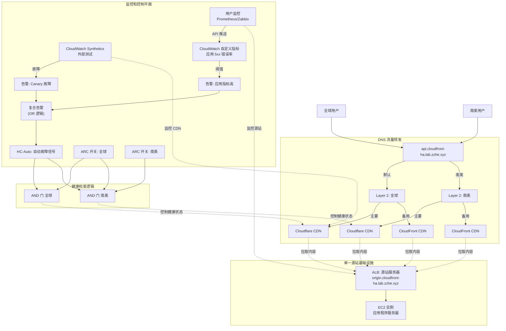

AWS 多 CDN 控制实验室

一个概念验证 (PoC) 项目，演示 **CDN 供应商冗余** 高可用架构。此实验室展示如何使用单一源站服务器和智能 DNS 路由在多个 CDN 提供商（Cloudflare 和 CloudFront）之间实现 **自动故障转移**。

🎯 问题描述

**CDN 供应商锁定风险**：依赖单一 CDN 提供商会造成单点故障。当您的主要 CDN 出现中断、性能下降或区域性问题时，整个服务将不可用，直到 CDN 恢复。

💡 解决方案

此实验室实现了一个 **多 CDN 架构**，具有以下特性：

**单一源站**：一个源站服务器供两个 CDN 供应商拉取内容，无需维护多套源站基础设施。

**智能 DNS 故障转移**：AWS Route 53 通过健康检查根据 CDN 可用性和地理位置自动在 Cloudflare（主要）和 CloudFront（备用）之间路由用户。

**手动覆盖控制**：ARC（应用程序恢复控制器）开关为计划维护、紧急响应或运营需求提供即时手动控制。

🏗 架构

## AWS Route 53 + 多 CDN (Cloudflare & CloudFront) 混合云高可用架构

### 1. 架构概述

此解决方案利用 AWS Route 53 作为流量控制平面，整合 Cloudflare（主要 CDN）和 CloudFront（备用/区域 CDN）。

**核心逻辑：**
- **分层路由**：全球和南美策略解耦（Layer 1 & Layer 2）进行 CDN 选择，但**共享相同的源站基础设施**
- **共享源站**：Cloudflare 和 CloudFront CDN（全球和南美）都从相同的后端源站服务器拉取内容
- **多源故障信号**：
  - 信号源 A：AWS CloudWatch Synthetics（外部合成测试）
  - 信号源 B：用户自建监控（内部业务指标，如 5xx 错误率）
  - 聚合逻辑：HC-Auto = 信号源 A OR 信号源 B
- **精细化控制**：保持全球/南美地区独立的手动故障恢复能力

#### **什么是 ARC（应用程序恢复控制器）？**

**AWS Route 53 应用程序恢复控制器（ARC）** 是一个高可用性服务，提供跨 AWS 区域和可用区的集中流量控制。在此实验室中，ARC 作为手动流量控制的"主开关"。

**ARC 核心概念：**
- **控制面板**：可以一起管理的路由控制的逻辑分组
- **路由控制**：可以打开/关闭以控制流量的独立开关
- **集群**：确保控制平面可用性的五个冗余区域端点集合

**为什么使用 ARC 而不是标准 Route 53 健康检查？**

| 功能 | 标准 Route 53 健康检查 | Route 53 ARC |
|------|------------------------|---------------|
| **自动故障转移** | ✅ 基于端点健康状态 | ✅ 基于端点健康状态 + 手动控制 |
| **手动覆盖** | ❌ 有限（需要健康检查操作） | ✅ 专用路由控制（开/关开关） |
| **跨区域控制** | ❌ 协调复杂 | ✅ 跨区域集中控制 |
| **紧急响应** | ❌ 慢（需要 DNS 更改） | ✅ 即时（切换开关） |
| **操作安全** | ❌ 配置错误风险 | ✅ 明确批准流程 |
| **成本** | 💰 较低（$0.50/健康检查/月） | 💰 较高（$195/集群/月 + $2.50/路由控制/月） |

**此实验室中的 ARC：**
- **HC-Switch-Global**：所有区域的 ARC 路由控制
- **HC-Switch-SA**：南美特定的 ARC 路由控制
- 这些开关提供对自动基于健康状态路由的 **即时手动覆盖** 功能

**成本优化说明：**
为了经济高效的学习，此实验室可以使用标准 Route 53 健康检查和"反向逻辑"模拟 ARC 行为，而不是完整的 ARC 服务。

**架构图：**



### 2. 单一源站 + 多 CDN 架构

**关键概念**：此实验室演示使用**一个源站服务器**配合**两个 CDN 供应商**实现高可用性。Route 53 处理 CDN 供应商之间的故障转移，而不是源站之间的故障转移。

**工作原理：**
- **单一源站**：一个源站服务器（ALB + EC2）位于 `origin.cloudfront-ha.lab.zzhe.xyz`
- **双 CDN 设置**：
  - **Cloudflare CDN** 从源站拉取内容（主要 CDN）
  - **CloudFront CDN** 从同一源站拉取内容（备用 CDN）
- **Route 53 故障转移**：根据 CDN 健康状态在 Cloudflare 和 CloudFront 之间路由终端用户
- **地理路由**：Route 53 还提供地理优化（全球 vs 南美）

**优势：**
- **CDN 供应商冗余**：如果一个 CDN 提供商出现问题，自动故障转移到另一个
- **单一源站维护**：只需管理和更新一个应用程序服务器
- **成本效益**：无源站重复，仅在需要时支付 CDN 带宽费用
- **供应商独立性**：不被锁定在单一 CDN 提供商

### 3. 详细配置步骤

**阶段 1：配置多源监控信号（新增功能）**

我们需要将用户监控数据集成到 AWS 中，并与 AWS 探测数据合并。

**1. 集成用户自建监控数据**

用户系统（如 Prometheus、Zabbix 或日志分析系统）需要调用 AWS API 报告关键指标。

操作：使用 AWS CLI 或 SDK (PutMetricData)

示例命令：
```bash
aws cloudwatch put-metric-data \
  --namespace "Custom/AppMetrics" \
  --metric-name "ApiErrorRate" \
  --value 5.2 \
  --unit Percent \
  --dimensions Region=Global
```

**创建告警（告警 B）：**
- 在 CloudWatch 中基于 Custom/AppMetrics -> ApiErrorRate 创建告警
- 阈值示例：当错误率在 5 分钟内 > 5% 时触发告警

**2. 创建复合告警**

合并"外部合成测试告警"和"内部业务告警"，避免单点误报或漏报。

前提条件：具备基于 Canary 的告警（告警 A）和基于用户指标的告警（告警 B）

操作：创建复合告警
- 逻辑表达式：ALARM(Alarm_A) OR ALARM(Alarm_B)
- 效果：当外部测试失败或内部业务指标恶化时，复合告警进入 ALARM 状态

**阶段 2：健康检查和 ARC 开关**

更新基础信号定义，使用复合告警作为自动信号源。

**HC-Auto（已更新）：**
- 类型：CloudWatch 告警
- 目标：选择前一步创建的复合告警
- 逻辑：当复合告警触发时，此 HC 变为不健康

**HC-Switch-Global（ARC 开关）：** 保持不变，用于手动全球控制
**HC-Switch-SA（ARC 开关）：** 保持不变，用于手动南美控制

**计算健康检查（逻辑组合）：**
- HC-Logic-Global (AND)：HC-Auto + HC-Switch-Global
- HC-Logic-SA (AND)：HC-Auto + HC-Switch-Global + HC-Switch-SA

**阶段 3：配置分层 DNS 记录 - 手动逐步指南**

此阶段设置两层 DNS 路由结构，实现基于地理位置的 CDN 选择和自动故障转移。

**DNS 层概述：**
- **Layer 1（入口点）**：地理路由，将用户引导到适当的区域规则
- **Layer 2（区域规则）**：每个地理区域内的故障转移逻辑

### 逐步 DNS 配置

#### 前提条件
- `cloudfront-ha.lab.zzhe.xyz` 的 Route 53 托管区域
- 阶段 2 创建的健康检查：HC-Logic-Global 和 HC-Logic-SA
- CDN 端点就绪：Cloudflare 和 CloudFront 配置

---

#### **步骤 1：创建 Layer 2 记录（区域故障转移规则）**

**1.1 创建全球区域故障转移记录**

导航到 Route 53 控制台 → 托管区域 → `cloudfront-ha.lab.zzhe.xyz`

**记录 1：全球主要（Cloudflare CDN）**
- **记录名称**：`global-rule.cloudfront-ha.lab.zzhe.xyz`
- **记录类型**：`CNAME`
- **别名**：否
- **值**：`your-site.cloudflare.com`（从 origin.cloudfront-ha.lab.zzhe.xyz 拉取的 Cloudflare CDN 端点）
- **路由策略**：`故障转移`
- **故障转移类型**：`主要`
- **健康检查**：选择 `HC-Logic-Global`（来自阶段 2）
- **记录 ID**：`global-primary`

**记录 2：全球备用（CloudFront CDN）**
- **记录名称**：`global-rule.cloudfront-ha.lab.zzhe.xyz`（与主要相同）
- **记录类型**：`CNAME`
- **别名**：是（用于 CloudFront 分发）
- **值**：`d123abc456.cloudfront.net`（从 origin.cloudfront-ha.lab.zzhe.xyz 拉取的 CloudFront 分发）
- **路由策略**：`故障转移`
- **故障转移类型**：`备用`
- **健康检查**：无（备用不需要健康检查）
- **记录 ID**：`global-secondary`

**1.2 创建南美区域故障转移记录**

**记录 3：南美主要（Cloudflare CDN）**
- **记录名称**：`sa-rule.cloudfront-ha.lab.zzhe.xyz`
- **记录类型**：`CNAME`
- **别名**：否
- **值**：`your-site.cloudflare.com`（相同的 Cloudflare CDN 端点）
- **路由策略**：`故障转移`
- **故障转移类型**：`主要`
- **健康检查**：选择 `HC-Logic-SA`（来自阶段 2）
- **记录 ID**：`sa-primary`

**记录 4：南美备用（CloudFront CDN）**
- **记录名称**：`sa-rule.cloudfront-ha.lab.zzhe.xyz`（与 SA 主要相同）
- **记录类型**：`CNAME`
- **别名**：是（用于 CloudFront）
- **值**：`d123abc456.cloudfront.net`（相同的 CloudFront 分发）
- **路由策略**：`故障转移`
- **故障转移类型**：`备用`
- **健康检查**：无
- **记录 ID**：`sa-secondary`

---

#### **步骤 2：创建 Layer 1 记录（地理入口点）**

**2.1 创建主 API 入口点**

**记录 5：默认/全球地理规则**
- **记录名称**：`api.cloudfront-ha.lab.zzhe.xyz`
- **记录类型**：`CNAME`
- **别名**：否
- **值**：`global-rule.cloudfront-ha.lab.zzhe.xyz`
- **路由策略**：`地理位置`
- **位置**：`默认`（捕获所有不匹配其他规则的流量）
- **记录 ID**：`api-default-global`

**记录 6：南美地理规则**
- **记录名称**：`api.cloudfront-ha.lab.zzhe.xyz`（与默认相同）
- **记录类型**：`CNAME`
- **别名**：否
- **值**：`sa-rule.cloudfront-ha.lab.zzhe.xyz`
- **路由策略**：`地理位置`
- **位置**：`南美`（选择大陆）
- **记录 ID**：`api-sa-specific`

---

#### **步骤 3：验证和测试**

**3.1 DNS 传播检查**
```bash
# 从不同地理位置测试
dig api.cloudfront-ha.lab.zzhe.xyz
nslookup api.cloudfront-ha.lab.zzhe.xyz

# 直接测试特定区域规则
dig global-rule.cloudfront-ha.lab.zzhe.xyz
dig sa-rule.cloudfront-ha.lab.zzhe.xyz
```

**3.2 健康检查验证**
- 转到 Route 53 控制台 → 健康检查
- 验证 `HC-Logic-Global` 和 `HC-Logic-SA` 显示"成功"状态
- 检查 CloudWatch 告警处于"正常"状态

**3.3 端到端流程测试**
```bash
# 从全球位置测试（应命中 global-rule → Cloudflare）
curl -I https://api.cloudfront-ha.lab.zzhe.xyz

# 通过触发健康检查故障测试故障转移
# （使用阶段 4 的模拟脚本）
```

---

#### **步骤 4：高级配置（可选）**

**4.1 添加其他地理区域**
如果您想要更精细的控制，可添加特定国家/地区：

```
- 欧洲：europe-rule.cloudfront-ha.lab.zzhe.xyz
- 亚洲：asia-rule.cloudfront-ha.lab.zzhe.xyz
```

**4.2 配置 TTL 值**
- 为更快的故障转移设置适当的 TTL 值：
  - Layer 1 记录：60 秒
  - Layer 2 主要记录：60 秒
  - Layer 2 备用记录：300 秒

**4.3 添加监控**
```bash
# 为 DNS 查询设置 CloudWatch 监控
aws logs create-log-group --log-group-name "/aws/route53/api.cloudfront-ha.lab.zzhe.xyz"
```

---

#### **步骤 5：配置验证清单**

- [ ] Layer 2 全球故障转移：`global-rule.cloudfront-ha.lab.zzhe.xyz` 已创建
- [ ] Layer 2 SA 故障转移：`sa-rule.cloudfront-ha.lab.zzhe.xyz` 已创建
- [ ] Layer 1 默认路由：`api.cloudfront-ha.lab.zzhe.xyz` → `global-rule`
- [ ] Layer 1 SA 路由：`api.cloudfront-ha.lab.zzhe.xyz` → `sa-rule`
- [ ] 健康检查仅附加到主要记录
- [ ] DNS 传播已完成（最多 24-48 小时）
- [ ] 从多个地理位置端到端测试成功

**最终 DNS 结构：**
```
api.cloudfront-ha.lab.zzhe.xyz（入口点）
├── 默认位置 → global-rule.cloudfront-ha.lab.zzhe.xyz
│   ├── 主要 → your-site.cloudflare.com（带 HC-Logic-Global）
│   └── 备用 → d123abc456.cloudfront.net
└── 南美 → sa-rule.cloudfront-ha.lab.zzhe.xyz
    ├── 主要 → your-site.cloudflare.com（带 HC-Logic-SA）
    └── 备用 → d123abc456.cloudfront.net

单一源站：origin.cloudfront-ha.lab.zzhe.xyz
├── Cloudflare CDN 从源站拉取
└── CloudFront CDN 从源站拉取
```

### 4. 运营场景测试

添加用户监控后的场景变化：

| 场景 | 触发条件 | 结果 |
|------|----------|------|
| 外部网络中断 | AWS Canary 检测到 Cloudflare 故障 → 告警 A 触发 → 复合告警触发 | 自动切换到 CloudFront |
| 内部业务异常 | 用户系统检测到 API 错误率激增 → 推送指标 → 告警 B 触发 → 复合告警触发 | 自动切换到 CloudFront |
| 误报过滤（可选） | 如果改为 AND 逻辑，需要双方同时告警才切换（通常不建议，建议使用 OR 逻辑以确保高可用性） | （取决于复合告警逻辑） |
| 手动强制切换 | 管理员手动关闭 ARC 开关 | 强制切换到 CloudFront |

### 5. 手动故障转移控制

架构通过 **ARC（应用程序恢复控制器）开关** 提供精细的手动控制，可以覆盖自动健康检查，用于计划维护或紧急情况。

#### **手动控制工作原理**

系统对健康检查使用 **AND 逻辑**：
- **HC-Logic-Global** = `HC-Auto` AND `HC-Switch-Global`
- **HC-Logic-SA** = `HC-Auto` AND `HC-Switch-Global` AND `HC-Switch-SA`

当任何开关设为 **OFF** 时，无论自动健康检查状态如何，都会强制流量转到备用 CDN。

#### **手动覆盖方法**

**1. 全球手动故障转移（影响所有地区）**
```bash
# 强制所有流量到备用 CDN (CloudFront)
aws route53-recovery-control-config update-control-panel \
  --control-panel-arn "arn:aws:route53-recovery-control::account:controlpanel/global-switch" \
  --routing-control-state OFF

# 恢复到自动行为
aws route53-recovery-control-config update-control-panel \
  --control-panel-arn "arn:aws:route53-recovery-control::account:controlpanel/global-switch" \
  --routing-control-state ON
```

**2. 南美特定手动故障转移**
```bash
# 仅强制南美流量到备用 CDN
aws route53-recovery-control-config update-control-panel \
  --control-panel-arn "arn:aws:route53-recovery-control::account:controlpanel/sa-switch" \
  --routing-control-state OFF

# 恢复南美到自动行为
aws route53-recovery-control-config update-control-panel \
  --control-panel-arn "arn:aws:route53-recovery-control::account:controlpanel/sa-switch" \
  --routing-control-state ON
```

**3. 通过 AWS 控制台**
1. 导航到 **Route 53 应用程序恢复控制器**
2. 选择您的 **控制面板**
3. 切换 **路由控制**：
   - `HC-Switch-Global`：控制所有地区
   - `HC-Switch-SA`：仅控制南美

**4. 通过模拟脚本**
```bash
# 使用提供的模拟脚本
python3 simulation/toggle_arc.py --state OFF --region global
python3 simulation/toggle_arc.py --state OFF --region sa

# 恢复自动行为
python3 simulation/toggle_arc.py --state ON --region global
python3 simulation/toggle_arc.py --state ON --region sa
```

#### **手动故障转移场景**

| 场景 | HC-Auto | HC-Switch-Global | HC-Switch-SA | 全球流量 | SA 流量 |
|------|---------|------------------|--------------|----------|---------|
| **正常运行** | ✅ 健康 | ✅ ON | ✅ ON | 主要 CDN (Cloudflare) | 主要 CDN (Cloudflare) |
| **自动故障转移** | ❌ 不健康 | ✅ ON | ✅ ON | 备用 CDN (CloudFront) | 备用 CDN (CloudFront) |
| **全球手动故障转移** | ✅ 健康 | ❌ **OFF** | ✅ ON | **备用 CDN (CloudFront)** | **备用 CDN (CloudFront)** |
| **SA 手动故障转移** | ✅ 健康 | ✅ ON | ❌ **OFF** | 主要 CDN (Cloudflare) | **备用 CDN (CloudFront)** |
| **双重手动覆盖** | ✅ 健康 | ❌ OFF | ❌ OFF | **备用 CDN (CloudFront)** | **备用 CDN (CloudFront)** |
| **紧急覆盖** | ❌ 不健康 | ❌ OFF | ❌ OFF | **备用 CDN (CloudFront)** | **备用 CDN (CloudFront)** |

#### **手动控制用例**

- **计划维护**：在执行 CDN 维护之前切换流量
- **性能测试**：路由特定地区测试 CDN 性能
- **紧急响应**：立即控制流量，无需等待健康检查
- **成本优化**：根据价格将流量路由到首选 CDN
- **合规性**：满足区域数据主权要求

#### **最佳实践**

- **记录变更**：始终记录手动故障转移操作和原因
- **团队协调**：在手动切换前通知相关团队
- **监控影响**：手动故障转移后观察指标，确保正常运行
- **计划恢复**：制定明确的返回自动模式程序
- **定期测试**：在维护窗口期间练习手动故障转移程序

### 6. 高级故障转移控制：禁用自动故障恢复

在生产环境中，您可能希望 **自动故障转移**（快速响应中断）但 **手动故障恢复**（受控恢复）。这可以防止主要 CDN 间歇性问题时 CDN 之间的"震荡"。

#### **挑战：自动故障恢复**

默认情况下，当 HC-Auto 恢复健康时，流量自动返回到 Cloudflare：
```
时间 10:00 - Cloudflare 健康 → 流量在 Cloudflare
时间 10:05 - Cloudflare 不健康 → 流量切换到 CloudFront（自动）
时间 10:07 - Cloudflare 再次健康 → 流量切换回 Cloudflare（自动）
时间 10:09 - Cloudflare 不健康 → 流量再次切换到 CloudFront（自动）
```

这种"震荡"可能导致服务不稳定。

#### **解决方案 1：粘性复合告警（推荐）**

创建一个需要在触发后 **手动重置** 的复合告警：

**步骤 1：创建粘性复合告警**
```bash
# 创建保持 ALARM 状态直到手动重置的复合告警
aws cloudwatch put-composite-alarm \
  --alarm-name "Composite-Alarm-CDN-Health-Sticky" \
  --alarm-rule "ALARM(Alarm_AWS) OR ALARM(Alarm_User)" \
  --actions-enabled true \
  --treat-missing-data ignore \
  --alarm-actions "arn:aws:sns:region:account:manual-intervention-topic"
```

**步骤 2：更新 HC-Auto 使用粘性告警**
```bash
# 将 HC-Auto 指向粘性复合告警
aws route53 change-health-check \
  --health-check-id "HC-AUTO-ID" \
  --alarm-name "Composite-Alarm-CDN-Health-Sticky"
```

**步骤 3：手动故障恢复过程**
```bash
# 准备故障恢复时，手动重置告警
aws cloudwatch set-alarm-state \
  --alarm-name "Composite-Alarm-CDN-Health-Sticky" \
  --state-value "OK" \
  --state-reason "Manual approval for failback to primary CDN"
```

**粘性告警行为：**
- ✅ **自动故障转移**：发生 CDN 问题时 → 流量转到 CloudFront
- ❌ **无自动故障恢复**：告警保持 ALARM 状态
- 🔧 **手动故障恢复**：运维团队在准备就绪时重置告警

#### **解决方案 2：非对称健康检查**

对故障转移（敏感）和故障恢复（手动控制）使用不同的健康检查：

**步骤 1：创建故障转移健康检查（敏感）**
```bash
# 敏感健康检查 - 快速故障以实现快速故障转移
aws route53 create-health-check \
  --caller-reference "failover-check-$(date +%s)" \
  --health-check-config \
    Type=CLOUDWATCH_METRIC,AlarmRegion=us-east-1,AlarmName=Composite-Alarm-CDN-Health,InsufficientDataHealthStatus=Failure,RequestInterval=30,FailureThreshold=2
```

**步骤 2：创建故障恢复健康检查（手动控制）**
```bash
# 创建监控手动批准端点的健康检查
aws route53 create-health-check \
  --caller-reference "failback-check-$(date +%s)" \
  --health-check-config \
    Type=HTTPS,ResourcePath=/approve-failback,FullyQualifiedDomainName=control.cloudfront-ha.lab.zzhe.xyz,Port=443,RequestInterval=30,FailureThreshold=3
```

**步骤 3：创建非对称逻辑结构**
```bash
# 为故障转移和故障恢复创建单独的计算健康检查
aws route53 create-health-check \
  --caller-reference "hc-logic-global-failover-$(date +%s)" \
  --health-check-config \
    Type=CALCULATED,ChildHealthChecks=["HC-Failover-ID","HC-Switch-Global-ID"],HealthThreshold=2,CloudWatchAlarmRegion=us-east-1

aws route53 create-health-check \
  --caller-reference "hc-logic-global-failback-$(date +%s)" \
  --health-check-config \
    Type=CALCULATED,ChildHealthChecks=["HC-Failback-ID","HC-Switch-Global-ID"],HealthThreshold=2,CloudWatchAlarmRegion=us-east-1
```

**步骤 4：使用非对称逻辑配置 DNS 记录**
- **主要记录（Cloudflare）**：使用 `HC-Logic-Global-Failback`（需要手动批准）
- **备用记录（CloudFront）**：使用 `HC-Logic-Global-Failover`（自动）

**步骤 5：手动故障恢复批准**
```bash
# 创建批准故障恢复的端点
curl -X POST https://control.cloudfront-ha.lab.zzhe.xyz/approve-failback \
  -H "Authorization: Bearer $ADMIN_TOKEN" \
  -d '{"region": "global", "approved_by": "operations-team"}'
```

#### **故障转移/故障恢复行为比较**

| 场景 | 默认行为 | 粘性告警（解决方案 1） | 非对称检查（解决方案 2） |
|------|----------|------------------------|--------------------------|
| **CDN 问题发生** | 自动故障转移到 CloudFront | 自动故障转移到 CloudFront | 自动故障转移到 CloudFront |
| **CDN 问题解决** | **自动故障恢复到 Cloudflare** | 保持在 CloudFront | 保持在 CloudFront |
| **手动干预** | N/A | 重置告警 → 故障恢复 | 批准端点 → 故障恢复 |
| **复杂度** | 低 | 中等 | 高 |
| **运营控制** | 无 | 高 | 非常高 |

#### **实施建议**

**对于大多数环境（解决方案 1 - 粘性告警）：**
- 易于实施和理解
- 清晰的手动批准过程
- 自动化和控制的良好平衡

**对于复杂环境（解决方案 2 - 非对称检查）：**
- 最大运营灵活性
- 可能的单独批准工作流
- 与变更管理系统集成

### 7. 附加说明

- **访问认证**：运行用户监控系统的服务器需要配置具有 `cloudwatch:PutMetricData` 权限的 IAM 角色或 AK/SK
- **成本优化**：自定义指标和告警产生的费用很少，与业务高可用性价值相比可以忽略不计
- **延迟**：PutMetricData 到告警触发通常有 1-3 分钟延迟（取决于标准分辨率还是高分辨率）。对于秒级响应，建议启用 CloudWatch 高分辨率指标（1 秒粒度）

目录结构

aws-multi-cdn-control-lab/
├── infrastructure/    # Pulumi IaC，用于 Route 53、ARC、单一源站 ALB 和 CDN 配置
├── control-plane/     # ALB 后的 Config API 的 EC2 实例
├── client-app/        # 演示"智能客户端"的 React Web 应用
└── simulation/        # 用于破坏 CDN 端点和切换开关的 Python 脚本


流量转发

**单一源站基础设施：**
- **源站服务器**：位于 `origin.cloudfront-ha.lab.zzhe.xyz` 的单一 ALB + EC2 实例

**CDN 供应商设置：**
- **Cloudflare CDN**：配置为从 `origin.cloudfront-ha.lab.zzhe.xyz` 拉取内容（主要 CDN）
- **CloudFront CDN**：配置为从 `origin.cloudfront-ha.lab.zzhe.xyz` 拉取内容（备用 CDN）

**重要**：此实验室演示 **CDN 供应商故障转移**，而不是源站故障转移。Cloudflare 和 CloudFront 都从同一个单一源站服务器缓存内容。Route 53 将终端用户路由到更健康的 CDN 供应商。

**控制平面**：在 ALB 后运行的高可用 API，运行在 EC2 实例上，读取我们的"紧急开关"（Route 53 ARC）状态。

客户端：

启动时获取配置。

尝试主要。

如果主要失败（诱发混乱），自动重试备用，无需等待 DNS 更新。

🚀 开始使用

前提条件

AWS CLI（为实验室配置管理员访问权限）

Pulumi CLI

Go 1.19+（用于基础设施代码）

Node.js v16+（用于客户端）

Python 3.9+（用于模拟脚本）

域名：访问 zzhe.xyz 域名以创建实验室子域 (*.cloudfront-ha.lab.zzhe.xyz)

1. 部署基础设施

使用 cloudfront-ha.lab.zzhe.xyz 子域配置 ALB 端点、EC2 实例、Route 53 区域和健康检查。

cd infrastructure
pulumi stack init
pulumi up


注意输出：
- config_api_url: https://api.cloudfront-ha.lab.zzhe.xyz
- origin_server_url: https://origin.cloudfront-ha.lab.zzhe.xyz
- cloudflare_cname: (由 Cloudflare 设置提供)
- cloudfront_distribution: (AWS CloudFront 分发域名)

2. 配置客户端

使用 Pulumi 输出的 ALB URL 更新客户端配置。

cd ../client-app
# 使用基础设施 URL 编辑 .env 或 src/config.ts
npm install
npm run dev


3. 运行模拟（混乱模式）

打开 Web 应用。您应该看到绿色状态（连接到主要）。

场景 A：模拟技术故障
运行脚本使"模拟主要"返回 503 错误。

python3 simulation/break_primary.py


观察客户端应用自动切换到备用（黄色/橙色状态）。

场景 B：手动终止开关
通过 AWS Route 53 ARC 强制流量转移。

python3 simulation/toggle_arc.py --state OFF


💰 成本警告

此实验室创建真实的 AWS 资源。

**Route 53 ARC**：如果使用完整 ARC 功能可能很昂贵（$195/月/集群 + $2.50/月/路由控制）。成本详情请参见架构部分的 ARC 对比表。为了经济高效的学习，此实验室可以使用标准 Route 53 健康检查 + 反向逻辑以显著较低的成本模拟 ARC 行为（约 $1-2/月 而不是约 $200/月）。

ALB + EC2：运行模拟服务的应用负载均衡器和 EC2 实例的成本。

CloudWatch：告警和指标的小额成本。

清理：完成后始终运行 pulumi destroy！

📜 许可证

MIT